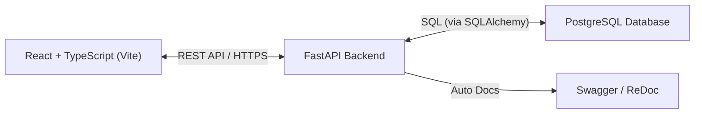

# SmartBank - Modular Banking Backend System

A full-stack Banking Application built with React + TypeScript + Vite on the frontend and FastAPI (Python) on the backend, powered by PostgreSQL.

It supports authentication, customer and bank admin management, and core banking operations like account creation, money transfers, and reporting.

## Architecture
Below is the architecture diagram illustrating the flow of the SmartBank application:

## Tech Stack
- **Frontend**: React (TypeScript), Vite, TailwindCSS, and React Router.
- **Backend**: Python FastAPI, Security (JWT).
- **Database**: PostgreSQL.
- **API Docs**: Swagger API documentation.
- **Containerization**: Docker, docker-compose

## Features

- **User Management**
  - Secure user registration and login with JWT authentication.
  - Password encryption and user profile management.

- **Account Management**
  - Create and view customer bank accounts.
  - Automatically generate unique account numbers.
  - Support for multiple account types (Savings, Current, Fixed Deposit).

- **Transactions**
  - Transfer money between accounts securely.
  - Real-time balance validation and transaction history.

- **Role-Based Access Control (RBAC)**
  - Separate roles for **Customer** and **Admin**.
  - Scoped permissions for accessing specific resources.

- **Admin Dashboard**
  - Admins can view all customers, accounts, and transactions.
  - System-wide reporting and insights.

- **API Documentation**
  - Auto-generated **OpenAPI (Swagger UI)** for easy testing and integration.

- **Dockerized Deployment**
  - Fully containerized using **Docker** and **docker-compose**.
  - Production-ready Docker artifacts for easy deployment.

## Application Overview

  ### 1. User Registration
   - Customer submits his personal details (name, email id, password etc.).
   - The system validates inputs and securely stores profiles in the database.

  ### 2. Account Creation
   - Customers can open different types of accounts (Savings, Current, FD).
   - The system auto-generates an account number and associates it with the user.
   - Initial deposit is recorded at account creation.

  ### 3. Money Transfer
  - Customers initiate a transfer request.
  - The backend validates sender’s balance and receiver’s account number.
  - On success, both accounts’ balances are updated atomically in PostgreSQL.

  ### 4. Reporting & Dashboard
  - Customers can view their account details, balances, and transactions.
  - Admins have access to a comprehensive dashboard showing all user and account data.
