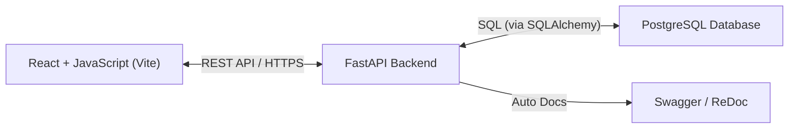

# SmartBank - Modular Banking Backend System

A full-stack Banking Application built with React + JavaScript + Vite on the frontend and FastAPI (Python) on the backend, powered by PostgreSQL.

It supports authentication, customer and bank admin management, and core banking operations like account creation, money transfers, and reporting.

## Architecture
Below is the architecture diagram illustrating the flow of the SmartBank application:

## Tech Stack
- **Frontend**: React (JavaScript), Vite, TailwindCSS, and React Router.
- **Backend**: Python FastAPI, Security (JWT).
- **Database**: PostgreSQL.
- **API Docs**: Swagger API documentation.
- **Containerization**: Docker, docker-compose

## Features

- **User Management**
  - Secure user registration and login with JWT authentication.
  - Password encryption and user profile management.

- **Account Management**
  - Create and view customer bank accounts.
  - Automatically generate unique account numbers.
  - Support for multiple account types (Savings, Current, Fixed Deposit).

- **Transactions**
  - Transfer money between accounts securely.
  - Real-time balance validation and transaction history.

- **Role-Based Access Control (RBAC)**
  - Separate roles for **Customer** and **Admin**.
  - Scoped permissions for accessing specific resources.

- **Admin Dashboard**
  - Admins can view all customers, accounts, and transactions.
  - System-wide reporting and insights.

- **API Documentation**
  - Auto-generated **OpenAPI (Swagger UI)** for easy testing and integration.

- **Dockerized Deployment**
  - Fully containerized using **Docker** and **docker-compose**.
  - Production-ready Docker artifacts for easy deployment.

## Application Overview

  ### 1. User Registration
   - Customer submits his personal details (name, email id, password etc.).
   - The system validates inputs and securely stores profiles in the database.

  ### 2. Account Creation
   - Customers can open different types of accounts (Savings, Current, FD).
   - The system auto-generates an account number and associates it with the user.
   - Initial deposit is recorded at account creation.

  ### 3. Money Transfer
  - Customers initiate a transfer request.
  - The backend validates sender’s balance and receiver’s account number.
  - On success, both accounts’ balances are updated atomically in PostgreSQL.

  ### 4. Reporting & Dashboard
  - Customers can view their account details, balances, and transactions.
  - Admins have access to a comprehensive dashboard showing all user and account data.

## API Endpoints

The following table lists the available API endpoints, their HTTP methods, and descriptions:

| Method | Endpoint | Description |
|--------|----------|-------------|
| **POST** | `/auth/register` | Register a new user with email, name, and password. Returns user details. |
| **POST** | `/auth/login` | Authenticate a user with email and password. Returns a JWT access token. |
| **POST** | `/accounts/` | Create a new bank account (e.g., savings or current) for the authenticated user with an initial deposit. Returns account details. |
| **GET** | `/accounts/` | Retrieve a list of all accounts owned by the authenticated user. |
| **POST** | `/accounts/withdraw` | Withdraw a specified amount from the authenticated user’s account. Returns updated account details. |
| **POST** | `/accounts/deposit` | Deposit a specified amount into the authenticated user’s account. Returns updated account details. |
| **POST** | `/accounts/transfer` | Transfer a specified amount from one account to another using the account number. Returns updated source account details. |
| **GET** | `/admin/users` | [Admin Only] Retrieve a list of all users in the system. |
| **POST** | `/admin/users/{user_id}/toggle-admin` | [Admin Only] Toggle the admin status of a specified user. |

### Authentication
- Most endpoints require a JWT token obtained via `/auth/login`.
- Include the token in the `Authorization` header as `Bearer <token>`.

### Database Models

The application uses SQLAlchemy ORM with a PostgreSQL database. Below are the database models, their fields, and relationships:

### User
Represents a user in the system.

| Field | Type | Description |
|-------|------|-------------|
| `id` | Integer | Primary key, unique identifier for the user. |
| `name` | String | User’s full name (required). |
| `email` | String | User’s email address (unique, required). |
| `hashed_password` | String | Hashed password using bcrypt (required). |
| `is_admin` | Boolean | Indicates if the user is an admin (default: `False`). |

**Relationships**:
- `accounts`: One-to-many relationship with `Account` (a user can have multiple accounts).

### Account
Represents a bank account owned by a user.

| Field | Type | Description |
|-------|------|-------------|
| `id` | Integer | Primary key, unique identifier for the account. |
| `account_number` | String | Unique 10-digit account number, auto-generated. |
| `account_type` | String | Type of account (e.g., "savings", "current"; required). |
| `balance` | Float | Current balance of the account (default: `0.0`). |
| `user_id` | Integer | Foreign key referencing `users.id`. |

**Relationships**:
- `owner`: Many-to-one relationship with `User` (each account belongs to one user).
- `transactions`: One-to-many relationship with `Transaction` (an account can have multiple transactions).

**Notes**:
- The `account_number` is automatically generated as a random 10-digit string during creation.

### Transaction
Represents a financial transaction (deposit, withdraw, or transfer).

| Field | Type | Description |
|-------|------|-------------|
| `id` | Integer | Primary key, unique identifier for the transaction. |
| `account_id` | Integer | Foreign key referencing `accounts.id`. |
| `type` | String | Transaction type ("withdraw", "deposit", or "transfer"). |
| `amount` | Float | Transaction amount (required). |
| `created_at` | DateTime | Timestamp of when the transaction was created (default: current UTC time). |

**Relationships**:
- `account`: Many-to-one relationship with `Account` (each transaction is associated with one account).

**Notes**:
- Currently, transfers are recorded with only the source `account_id`. To track the destination account, consider adding a `to_account_id` field (see Future Improvements).